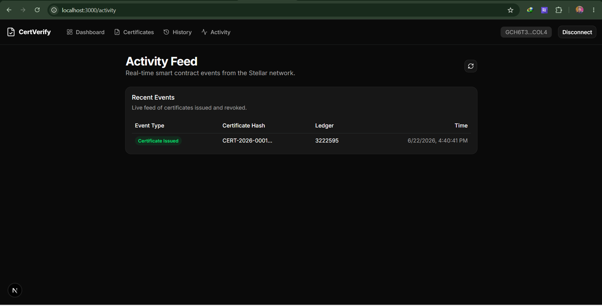

# Digital Certificate Verification Platform 🎓

A modern, decentralized web application for issuing, verifying, and managing digital certificates using the **Stellar Network** and **Soroban Smart Contracts**.


## 🌟 Overview

The Digital Certificate Verification Platform is designed to prevent credential fraud by leveraging blockchain technology. Educational institutions and certificate authorities can securely issue tamper-proof digital certificates on the Stellar blockchain, which can then be instantly verified by anyone.

### Core Features

- 🔐 **Wallet Integration:** Seamlessly connect using Freighter wallet via `stellar-wallets-kit`.
- 📜 **Issue Certificates:** Authorized administrators can issue digital certificates anchored to the Stellar blockchain.
- ✅ **Instant Verification:** Anyone can verify the authenticity and validity status of a certificate by its unique cryptographic hash.
- 🚫 **Revocation:** Administrators have the ability to revoke certificates if they are issued in error or compromised.
- 🕒 **Live On-Chain History:** View a real-time history of smart contract interactions powered by the Stellar Horizon API.



---

## 🏗️ Smart Contract Architecture

The core of the platform is powered by a **Soroban Smart Contract** written in Rust.

**Contract ID (Stellar Testnet):** 
[`CBZFKTBGZOBA7KWHV3AMMEL7UNK6LE37PWAA3YGPYPXNM7K6WHINEGGO`](https://stellar.expert/explorer/testnet/contract/CBZFKTBGZOBA7KWHV3AMMEL7UNK6LE37PWAA3YGPYPXNM7K6WHINEGGO)


### Contract Endpoints
- `init(admin: Address)`: Initializes the contract and sets the permanent Admin.
- `issue_cert(hash: String, recipient: Address)`: Issues a new valid certificate (Admin only).
- `revoke_cert(hash: String)`: Invalidates an existing certificate (Admin only).
- `verify_cert(hash: String) -> bool`: Checks if a certificate is valid and not revoked.
- `get_cert(hash: String) -> Certificate`: Retrieves the full on-chain metadata for a certificate.

---

## 💻 Tech Stack

**Frontend:**
- [Next.js](https://nextjs.org/) (App Router, React 19)
- [Tailwind CSS](https://tailwindcss.com/) & [shadcn/ui](https://ui.shadcn.com/)
- [Zustand](https://zustand-demo.pmnd.rs/) (State management with persistence)
- [Lucide Icons](https://lucide.dev/)

**Blockchain:**
- [Stellar SDK](https://github.com/stellar/js-stellar-sdk)
- [Soroban RPC](https://soroban.stellar.org/)
- [Stellar Wallets Kit](https://github.com/Creit-Tech/Stellar-Wallets-Kit)
- [Rust](https://www.rust-lang.org/) (Soroban Smart Contracts)

---

## 🚀 Getting Started

### Prerequisites

- [Node.js](https://nodejs.org/en/) (v18+)
- [Freighter Wallet](https://www.freighter.app/) Browser Extension
- Stellar Testnet tokens (for the Freighter wallet)

### Installation

1. **Clone the repository:**
   ```bash
   git clone <your-repo-url>
   cd digital-certificate-verification-platform
   ```

2. **Install dependencies:**
   ```bash
   npm install
   ```

3. **Set up Environment Variables:**
   Create a `.env.local` file in the root directory:
   ```env
   NEXT_PUBLIC_STELLAR_NETWORK=TESTNET
   NEXT_PUBLIC_STELLAR_RPC_URL=https://soroban-testnet.stellar.org
   NEXT_PUBLIC_STELLAR_NETWORK_PASSPHRASE="Test SDF Network ; September 2015"
   NEXT_PUBLIC_CONTRACT_ID=CBZFKTBGZOBA7KWHV3AMMEL7UNK6LE37PWAA3YGPYPXNM7K6WHINEGGO
   ```

4. **Run the development server:**
   ```bash
   npm run dev
   ```

5. Open [http://localhost:3000](http://localhost:3000) in your browser.

---

## 📝 License

This project is licensed under the MIT License.
