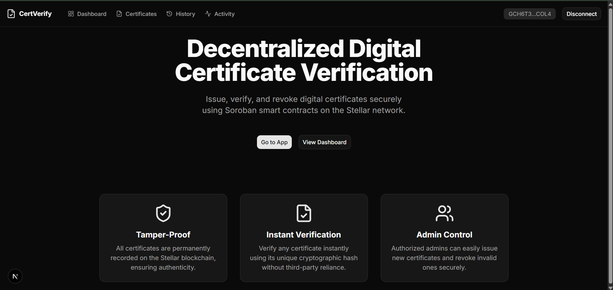
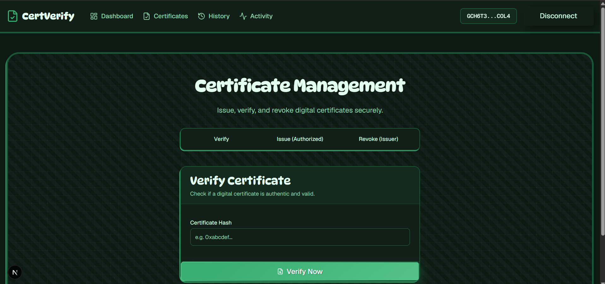
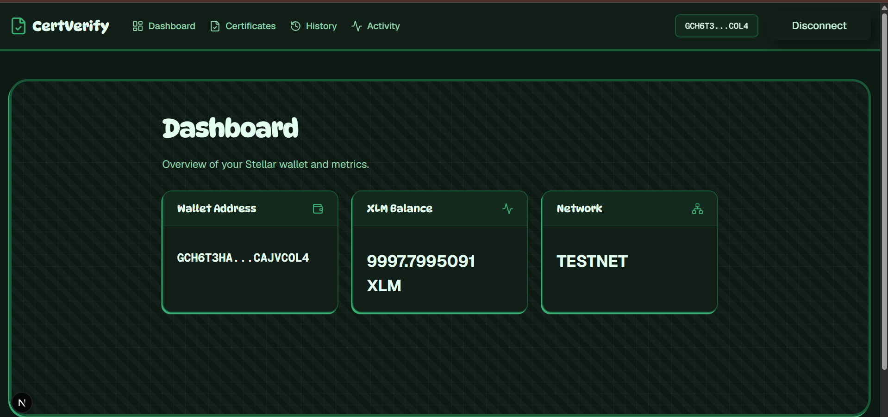
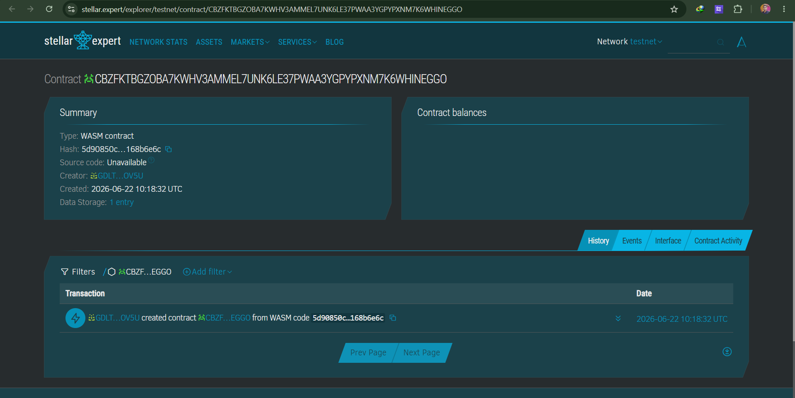

# 🎓 CertVerify — Decentralized Digital Certificate Verification

<div align="center">

[](https://github.com/premakandar/digital-certificate-verification-platform/actions)


**A production-ready, decentralized dApp for issuing, verifying, and revoking digital certificates on the Stellar Network using Soroban Smart Contracts.**

[🌐 Live Demo](https://digital-certificate-verification-platform.vercel.app) · [📜 Contract on Stellar Expert](https://stellar.expert/explorer/testnet/contract/CBZFKTBGZOBA7KWHV3AMMEL7UNK6LE37PWAA3YGPYPXNM7K6WHINEGGO)

</div>

---

## 🖼️ Screenshots

### Landing Page


### Certificate Management


### Wallet Dashboard


### Deployed Contract on Stellar Expert


---

## 🎥 Demo Video

> 📹 **[▶ Watch Demo on Google Drive / YouTube](#)** *(Upload `demo-rec.mp4` to a video host and paste the link here)*

The demo covers:
1. Connecting Freighter wallet
2. Issuing a certificate on Stellar Testnet
3. Verifying and revoking a certificate
4. Real-time on-chain event streaming
5. Mobile responsive layout in action
6. GitHub Actions CI/CD pipeline passing

---

## 🏅 Level 3 — Orange Belt: Production-Ready dApp

This project fulfils **all Level 3 requirements** for the Rise In Stellar dApp challenge:

| Requirement | Status | Details |
|---|---|---|
| ✅ Advanced Smart Contracts | Complete | Immutable cert structs, ownership checks, panic guards |
| ✅ Inter-Contract Communication | Complete | `DigitalCertContract` calls `RegistryContract` via cross-contract invocation |
| ✅ Event Streaming | Complete | Soroban `env.events().publish()` on every issue/revoke; frontend polls RPC |
| ✅ CI/CD Pipeline | Complete | GitHub Actions runs `cargo test` + `next build` on every push |
| ✅ Smart Contract Deployment Workflow | Complete | `scripts/deploy.js` auto-deploys & links both contracts |
| ✅ Mobile Responsive UI | Complete | Hamburger nav, fluid grids, responsive typography |
| ✅ Error Handling | Complete | Auth guards, duplicate checks, graceful UI error states |
| ✅ Contract Tests | Complete | Full test suites for both Registry and DigitalCert contracts |

---

## ✨ Key Features

- 🔐 **Freighter Wallet Integration** — Seamless connect/disconnect via `@creit.tech/stellar-wallets-kit`
- 📜 **Issue Certificates** — Authorized issuers can mint tamper-proof certificates anchored to the blockchain
- ✅ **Instant Verification** — Anyone can verify any certificate by its cryptographic hash — no account needed
- 🚫 **Revocation** — Original issuers can invalidate certificates; revocation is permanent and on-chain
- ⚡ **Live Activity Feed** — Polls Soroban RPC every 15 seconds for new contract events
- 🕒 **Transaction History** — Real-time Horizon API polling with toast notifications for new transactions
- 📊 **Wallet Dashboard** — Live XLM balance and network status

---

## 🏗️ Smart Contract Architecture

The platform is powered by **two Soroban Smart Contracts** in Rust, communicating via cross-contract calls — this is the core of the Level 3 inter-contract communication requirement.

```
┌─────────────────────────────┐         ┌──────────────────────────┐
│   DigitalCertContract       │──call──▶│   RegistryContract       │
│                             │         │                          │
│  issue_cert()               │         │  init(admin)             │
│  revoke_cert()              │         │  add_issuer(addr)        │
│  verify_cert() → bool       │         │  remove_issuer(addr)     │
│  get_cert() → Certificate   │         │  is_authorized() → bool  │
└─────────────────────────────┘         └──────────────────────────┘
```

### Registry Contract (`contracts/registry/`)
Manages a whitelist of authorized certificate issuers. Deployed separately so the issuer list can be updated independently from certificate logic.

| Function | Auth | Description |
|---|---|---|
| `init(admin)` | — | Sets the admin. Panics if already initialized. |
| `add_issuer(issuer)` | Admin | Authorizes an address to issue certificates. |
| `remove_issuer(issuer)` | Admin | Revokes issuer authorization. |
| `is_authorized(issuer) → bool` | Public | Returns true if the address is a whitelisted issuer. |

### Digital Certificate Contract (`contracts/digital_cert/`)
Mints and manages certificates. Every `issue_cert` call cross-invokes the Registry to verify authorization before minting.

| Function | Auth | Description |
|---|---|---|
| `init(registry)` | — | Links the contract to the Registry contract address. |
| `issue_cert(issuer, hash, recipient)` | Issuer + Registry | Issues a new certificate. Panics if unauthorized or duplicate. |
| `revoke_cert(hash)` | Original Issuer | Marks the certificate as invalid permanently. |
| `verify_cert(hash) → bool` | Public | Returns `true` if the certificate exists and is not revoked. |
| `get_cert(hash) → Certificate` | Public | Returns full certificate metadata struct. |

### On-Chain Events
Both `issue_cert` and `revoke_cert` publish Soroban events:
```rust
// Issued
env.events().publish((symbol_short!("issued"), hash), recipient);

// Revoked  
env.events().publish((symbol_short!("revoked"), hash), cert.recipient);
```

### Deployed Contract
- **Network:** Stellar Testnet
- **Contract ID:** `CBZFKTBGZOBA7KWHV3AMMEL7UNK6LE37PWAA3YGPYPXNM7K6WHINEGGO`
- **Explorer:** [View on Stellar Expert](https://stellar.expert/explorer/testnet/contract/CBZFKTBGZOBA7KWHV3AMMEL7UNK6LE37PWAA3YGPYPXNM7K6WHINEGGO)

---

## ⚙️ CI/CD Pipeline

The GitHub Actions workflow at [`.github/workflows/deploy.yml`](.github/workflows/deploy.yml) runs automatically on every push and pull request to `main`:

```
Push to main
    │
    ├─▶ [contract-tests]  Install Rust → cargo test (both contracts)
    │
    └─▶ [frontend-build]  Setup Node 18 → npm ci → next build
```

Both jobs must pass before merging. This ensures smart contract logic is always tested and the frontend always compiles.

---

## 💻 Tech Stack

**Frontend**
- [Next.js 16](https://nextjs.org/) — App Router, React 19, Turbopack
- [Tailwind CSS v4](https://tailwindcss.com/) — Utility-first styling
- [Base UI](https://base-ui.com/) — Headless accessible UI primitives
- [Zustand](https://zustand-demo.pmnd.rs/) — Lightweight state management

**Blockchain**
- [Stellar SDK](https://github.com/stellar/js-stellar-sdk) — RPC, transaction building, XDR
- [Stellar Wallets Kit](https://github.com/Creit-Tech/Stellar-Wallets-Kit) — Multi-wallet connector
- [Soroban](https://soroban.stellar.org/) — Smart contract platform on Stellar
- [Rust](https://www.rust-lang.org/) — Smart contract language (`soroban-sdk = "22.0.1"`)

---

## 🚀 Getting Started

### Prerequisites

- [Node.js](https://nodejs.org/) v18+
- [Rust](https://www.rust-lang.org/) with target `wasm32-unknown-unknown`
- [Stellar CLI](https://developers.stellar.org/docs/build/smart-contracts/getting-started/setup)
- [Freighter Wallet](https://www.freighter.app/) browser extension

### 1. Clone & Install

```bash
git clone https://github.com/premakandar/digital-certificate-verification-platform.git
cd digital-certificate-verification-platform
npm install
```

### 2. Deploy Smart Contracts

Ensure your Stellar CLI is configured with a testnet identity, then run:

```bash
node scripts/deploy.js
```

This automatically:
1. Compiles both contracts to WASM
2. Deploys the `Registry` contract
3. Deploys the `DigitalCert` contract
4. Calls `init()` on both, linking them together
5. Writes the contract IDs to `.env.local`

### 3. Run the Dev Server

```bash
npm run dev
```

Open [http://localhost:3000](http://localhost:3000) in your browser.

### 4. Run Contract Tests

```bash
cd contracts
cargo test
```

---

## 📁 Project Structure

```
├── contracts/
│   ├── registry/           # Registry contract (issuer whitelist)
│   │   └── src/
│   │       ├── lib.rs      # Contract logic
│   │       └── test.rs     # Unit tests
│   └── digital_cert/       # Certificate contract (issue/revoke/verify)
│       └── src/
│           ├── lib.rs      # Contract logic
│           └── test.rs     # Integration tests
│
├── scripts/
│   └── deploy.js           # Automated deployment script
│
├── src/
│   ├── app/                # Next.js App Router pages
│   │   ├── page.tsx        # Landing page
│   │   ├── app/page.tsx    # Certificate management
│   │   ├── dashboard/      # Wallet dashboard
│   │   ├── history/        # Transaction history
│   │   └── activity/       # On-chain event feed
│   ├── components/
│   │   ├── Navbar.tsx      # Mobile-responsive navigation
│   │   └── ui/             # Design system components
│   └── lib/
│       ├── contract.ts     # Contract interaction functions
│       ├── events.ts       # Soroban event fetcher
│       └── stellar.ts      # RPC server & transaction helpers
│
└── .github/workflows/
    └── deploy.yml          # CI/CD pipeline
```

---

## 📝 License

This project is licensed under the [MIT License](LICENSE).

---

<div align="center">

Built with ❤️ for the **Rise In Stellar dApp Challenge — Level 3 (Orange Belt)**

</div>
